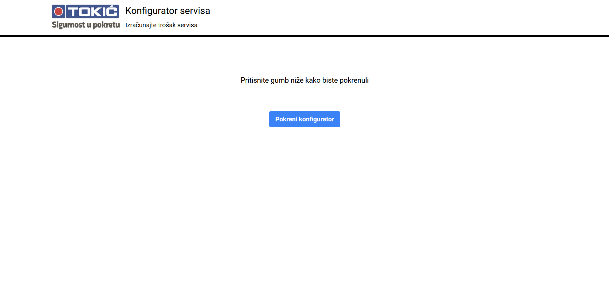

# Konfigurator servisa

Version 1.0



# Local Project setup

```shell
git clone https://github.com/kristijan-kresic-hvar/konfigurator_servisa.git

cd konfigurator_servisa

npm install or yarn

npm run dev or yarn dev
```